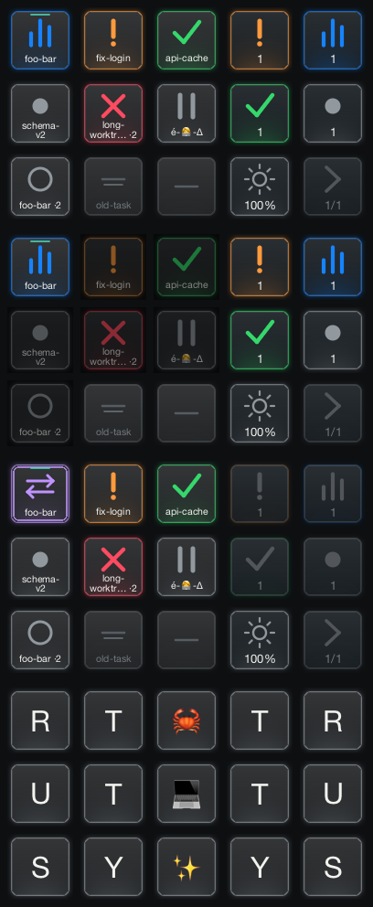

# Rustty agent dashboard for Stream Deck

Rustty owns one USB device and one tile per **reporting live Rustty pane**, across
all windows and tabs. The companion Codex TUI emits private pane-local OSC status;
normal launching and shared daemon use are unchanged. Hidden subagents have no
separate tiles. Two panes in the same directory remain distinct. Switching the
thread displayed by a TUI updates its existing tile.

The dashboard needs no daemon: Rustty holds pane status, layout and device state.
Codex may use its own existing shared app-server or its embedded app-server;
neither changes Rustty's ownership. The emitter runs inside the Codex TUI.

## Enable without installing anything

Build the two checkouts; do not replace installed applications:

```sh
# Rustty checkout
cargo build -p rustty-app --bin rustty
# Codex checkout
cd /Users/byron/dev/github.com/openai/codex/codex-rs
CARGO_TARGET_DIR=/tmp/codex-rustty-build cargo build -p codex-cli --bin codex
```

Launch the Rustty checkout binary with `--stream-deck=true`. For a lasting opt-in,
add this to **Rustty's** settings (the integration defaults off):

```text
stream-deck = true
# Only needed when more than one device is connected:
# stream-deck-serial = YOUR_SERIAL
```

Within its panes, launch the companion Codex binary normally with a per-invocation
override; this does not edit global Codex settings:

```sh
/tmp/codex-rustty-build/debug/codex \
  -c 'tui.terminal_status="rustty"'
```

Alternatively enable `terminal_status = "rustty"` under `[tui]` in a configuration
you explicitly choose to edit. No `TERM_PROGRAM` detection, launcher, registry,
plugin hook, daemon, session-to-pane mapping, or per-key profile is required.

Only one controller should own the selected device. Stop the standalone
`stream-deck-ctrl` prototype deliberately if it is running; do not terminate
unrelated controllers. Reloading Rustty settings enables/disables discovery and
connection ownership. Unplugging or USB errors leave terminals running.

For a disposable reporter, run `rustty agent-sim` inside a Rustty pane. It cycles
all seven states every three seconds; `--state working` holds one state and
`--interval 0.5` changes the reporting cadence. Ctrl-C unregisters it.
See [protocol, simulator and demo](../rustty-agent-status.md).
For the icon meanings and controls, print a separate reference in any terminal:

```sh
target/debug/rustty stream-deck-legend
```

The legend does not open the device or start a desktop window. Agent and function
keys use large icons instead of state/function words. Function keys retain their
small counts, brightness percentage and page indicator. An agent's remaining
space holds a short task slug with margins; long names wrap and shorten by
grapheme rather than shrinking the font.

Names come from the pane's directory, independently of pane/tab titles, reporter
prose or opaque thread IDs. A terminal title that exactly names a directory in
the pane's path can identify the worktree above a nested working directory;
otherwise the current directory name is used. The `project.task` naming convention
strips the first prefix: `gitoxide.foo-bar` becomes `foo-bar`, and
`gitoxide.foo.bar` becomes `foo.bar`. Names without a dot stay whole. Leading-dot
names are retained. This is name formatting, not a Git
worktree scan; a plain dotted directory follows the same convention.

The source and test previews use actual 72×72 key images, showing the normal
board, dim flashing phase, move mode, and no-session board from top to bottom:



## Fixed 5×3 layout

| Agent | Agent | Agent | Function | Function |
|---|---|---|---|---|
| 1 | 2 | 3 | ! count | ▂█▅ count |
| 4 | 5 | 6 | ✓ count | ● count |
| 7 | 8 | 9 | ☀ level | › current/total |

The left 3×3 region holds nine logical slots per page. Physical indexes come from
the driver's layout metadata (agents 0,1,2,5,6,7,10,11,12; functions 3,4,8,9,13,14).
Only display devices with exactly five columns, three rows and fifteen keys are
accepted in this version. Mini, XL, Neo, Plus and Pedal layouts are rejected
clearly; there is no claim that every model has a 3×3 agent area.

A short agent-key tap reveals and focuses its exact pane. Hold for **two seconds**
to enter move mode; release does not focus or cancel. The next fresh agent-key
press swaps assignments, including empty slots and inactive reservations. Press
the same logical source slot to cancel. The destination may be pressed while the
source is still held; already-held keys are not fresh destinations. Releases are
consumed. The source slug remains visible with purple ⇄ swap arrows and outline.

During move mode **Page and Brightness still work**. The four state-cycle keys
are dimmed and disabled. Function keys cannot be moved. Page advances/wraps and
has no effect when there is one page. Status, label and focus changes never sort
or compact slots. Interior holes stay holes.

Input, Working, Done and Idle cycle all live reporting panes in stable slot order,
including off-page and hidden panes. They advance from the focused matching pane,
otherwise from the group's last slot cursor, and wrap. Membership is recomputed
each time; an empty group is dimmed and inert. The selected pane's page is revealed.
Error, paused and unknown remain directly tappable and pageable without separate
cycle keys. These actions never approve a request, submit a prompt or send agent
keystrokes.

Brightness starts at 100%; successive taps select **25 → 50 → 75 → 100 → 25%**.
The worker changes the displayed level only after a successful USB write. The
selected level lives in memory and is reapplied on reconnect; it is not read back
from the device or saved to disk. Holding a function key does not repeat it.

## Status and completion semantics

| State | Source/meaning |
|---|---|
| Idle | Attached/ready, cancellation, or locally acknowledged completion |
| Working | Current displayed thread is active without stronger request/error evidence |
| Needs input | A pending approval or input request, including nonblocking requests |
| Done | An observed completed turn available to inspect; not proof of success |
| Error | Explicit relevant thread/turn error |
| Paused | Explicit pause; not the symbol for a nonblocking question |
| Unknown | Lost/unloaded status or insufficient evidence; never inferred completion |

Codex reports both thread and turn IDs. Rustty acknowledges done locally when its
pane is revealed/focused, projecting that completion as idle without sending
anything to Codex. Duplicate completed-turn snapshots stay acknowledged across
A/T1 → B → A/T1; A/T2 is new. Each pane retains the last acknowledged completion
for up to 64 threads in its current reporting lifecycle. Evicting a thread can
make its old completion appear unread again. A new begin replaces the lifecycle.

Unseen important states flash the agent tile between normal and 55% artwork
intensity every 600 ms, retaining its icon and slug. Needs input, Done, Error,
Paused and Unknown flash on first observation or a new transition; Idle flashes
when an existing thread becomes ready/stops, including cancellation or interruption.
Initial Idle and Working remain quiet. Revealing/focusing the pane stops its flash;
states arriving while it is focused are immediately seen. This does not resolve
requests or change status, except for the existing Done-to-Idle acknowledgement.
Duplicate snapshots and label changes do not restart flashing; a new completed
turn or a later important state does. Attention history shares the 64-thread
lifecycle bound with completion acknowledgements, so eviction can make an old
state appear unseen again. Device reconnect and screen sleep preserve this state;
sleep suppresses rendering and focus acknowledgement. Only agent tiles on the
current page flash; Page and state counts remain fixed. Move-source artwork stays
steady until the move ends. Flashing never changes key targets or tile positions.
The v1 protocol has no request identity: same-state updates cannot distinguish a
new approval from a duplicate. A new observed state transition is needed to rearm.

Existing Rustty title/progress presentation remains available; it cannot override
an explicit structured status or register a session. Progress expiry, redraw,
RIS and compaction are not exits. Normal end, pane/PTY exit, or a trustworthy
foreground-command end clears registration. A crash with no observable cleanup
boundary can leave uncertain state. There is no heartbeat or silence-to-done rule.

## Empty board and persistence

With zero live registered sessions the entire board becomes:

| | | | | |
|---|---|---|---|---|
| R | T | 🦀 | T | R |
| U | T | 💻 | T | U |
| S | Y | ✨ | Y | S |

These keys are decorative and inert. Idle/done sessions still count. Transitions
cancel gestures and suppress keys held across the change. The USB owner stays
connected and preserves the selected brightness. The next begin restores the
normal board and existing positions.

Workspace `deck_positions` stores a bounded vector of optional pane IDs. Status,
thread/turn IDs, USB handles and gestures are never persisted. Ending a reporter
reserves its live pane's slot quietly; closing the pane leaves a hole. New reporters
take the first free hole, otherwise reclaim the first inactive reservation in slot
order, and only then extend the board. Registered reporters keep their positions
in every state, including Idle and Done. Reclaiming a reservation does not close
its pane; if it reports again, it receives an available slot using the same rules.
Assignments and eviction wait until any hold/swap gesture ends. Imports keep
current positions and imported panes receive positions on first report.
Terminal undo/redo preserves the current dashboard arrangement; swaps do not add
terminal-layout history. Invalid auxiliary references are normalized without
losing the terminal workspace. `window-save-state=never` makes arrangements
session-only. Older Rustty versions may drop the optional field when saving.

On macOS, screen sleep (and impending system sleep) sends 0% brightness through
the USB owner without clearing artwork, registrations or positions. Image uploads
pause until the screens wake; then Rustty restores the selected brightness and
refreshes the latest board. Connecting while screens are asleep also starts at 0%.
Locking alone leaves the board intact; if the lock screen later sleeps, the same
dimming/restoration applies. Pending gestures are cancelled and keys held across
sleep/wake cannot trigger actions. Done is not acknowledged while screens sleep.
The driver has no power-off command: 0% is its lowest brightness, not USB power
removal. The pre-system-sleep write is best effort if macOS suspends the process or
USB first; wake/reconnect restores from Rustty's retained state. Windows keeps its
current behavior; screen-power integration is macOS-only in this version.

## Ownership and limitations

Discovery is a short off-UI enumeration at most once a second while enabled and
absent. There is no resident absent-device USB/rendering worker. A suitable
candidate starts a single connection-scoped owner of HID, fonts, images and reads.
On macOS, a scoped exclusive guard releases hidapi 2.6.7's process-global HID
manager before its owning thread exits. Its C backend otherwise retains a dead
discovery-thread run loop, which caused an observed crash during worker startup.
The guard covers all HID use in this application; the pinned backend's public
`hid_exit` cleanup runs after device handles are dropped. No unsafe Send/Sync or
resident discovery thread is used.

A single pending semantic snapshot coalesces updates; a bounded action queue
wakes the UI. Reconnect waits for the previous worker to finish. Input is polled
with 20 ms finite reads between individual changed-tile uploads; the hold timer
advances without incoming HID events. No external accessibility daemon is used.

| Category | Boundary |
|---|---|
| Driver/device | Pinned `elgato-streamdeck` c8b9f854 (0.13.2); no image, profile, brightness or pane-map readback. Previous artwork/settings cannot be restored. Only USB display devices with the accepted 5×3 layout; backend HID writes have no driver-level timeout. |
| Codex producer | Full automatic reports require the companion TUI option. Stock notification/hook configuration does not provide registration, working start and request resolution. |
| Scope | One tile per reporting pane and one device. No hidden-subagent/outside-Rustty tiles, approval, command, usage, dial/touch/LCD or desktop Micro actions. |
| Semantics | Done observes a turn completion, not task success. Any process sharing a PTY can spoof that pane's metadata. Unobserved crash cleanup remains uncertain. |
| Multiplexers | One reporter through passthrough fits v1. Multiple tmux reporters sharing one Rustty PTY exceed the serialized single-reporter contract. |
| Layout | Exact 9+6 region targets 5×3 devices; other layouts are rejected. Input/error/paused shapes are distinct; only the four listed groups cycle. Brightness is memory-only. |
| Persistence | Workspace save policy applies, IDs only reserve positions, and restored panes require a new begin report. Bounded completion-ack history is runtime-only. |
| Input race | UI validates captured assignments and reporter generations. USB reports cannot identify which image generation was physically seen; a bounded upload/input race remains. Startup held-key baselines suppress stale presses. |
| Verification | Offscreen/unit tests do not certify firmware, physical readability, button timing, OS focus, SSH/tmux/ConPTY or installed binaries. See the validation record below. |

The renderer adapts the dark inset face, colored rim/glow and shapes of
[dazer1234/codex-stream-deck at 6d7d14b9](https://github.com/dazer1234/codex-stream-deck/tree/6d7d14b9c966de305617a43a7ac22c7034ac075e).
Its MIT notice is retained in [the reference license](stream-deck-reference-LICENSE.txt).
Text uses Rustty system shaping/fallback, with grapheme-aware bounds and correct
premultiplied sRGB color-glyph compositing. Missing glyph coverage still depends
on installed system fonts.

## Reproduce validation

```sh
cargo test --workspace --all-features
cargo clippy --workspace --all-targets --all-features -- -D warnings
cargo fmt --check
cargo check -p rustty-app --all-targets --target aarch64-pc-windows-msvc
RUSTTY_DECK_PREVIEW=/tmp/rustty-deck.png \
  cargo test -p rustty-app --lib deck_device::tests::contact_sheet -- --ignored
RUSTTY_SMOKE_DIR=/tmp/rustty-deck-native-check RUSTTY_SMOKE_OFFSCREEN=1 \
  RUSTTY_SMOKE_DECK=1 target/debug/rustty --config-file=/tmp/empty-rustty.conf
```

The native smoke fixture forces USB off and uses test-owned shells/workspace.
The explicitly ignored `hardware_usb_smoke` test opens the physical device and
replaces its images/brightness; run only after deliberately transferring ownership.

## Validation record (2026-10-08)

Implementation started from clean Rustty `rustty` at `b24fbb556` (newer than the
research checkout), clean Codex `my-queue` at `1f0b5a95`, and clean prototype
`de2625de`. No Ghostty production source, installed application or global Codex
configuration was changed.

- macOS arm64: full Rustty workspace/all-features run passed **598 tests**, with
  5 explicitly ignored tests; strict workspace/all-targets/all-features Clippy
  and formatting passed. Protocol, lifecycle, layout, gesture, renderer and fake
  device behavior are covered.
- The built-in `agent-sim` passed real macOS PTY checks for terminal-output
  enforcement, fixed/cycling status, signal cadence, prompt Ctrl-C cleanup even
  with a 60-second interval, and ordered end/begin through suspend/resume.
  Windows compilation passed; its console-control runtime remains untested.
- Windows ARM64: `cargo check -p rustty-app --all-targets --target
  aarch64-pc-windows-msvc` passed. This is compilation evidence, not Windows
  execution, ConPTY or physical USB certification.
- Companion Codex: the 12 tests matching `terminal_status`, three existing OSC9
  tests, eight daemon-startup tests and the config opt-in test passed, along with
  formatting and strict `codex-tui --lib --tests --no-deps` Clippy.
  Dependency-inclusive Clippy stops on
  an unchanged `clippy::let_and_return` in `app-server/src/message_processor.rs:372`.
  The committed source matches the isolated tested checkout. See the companion's
  `docs/rustty-agent-status.md` for the commands and transition evidence.
- Actual Codex CLI processes passed a disposable macOS PTY check: two ordinary
  TUIs in the same directory used one existing isolated local daemon and emitted
  distinct thread IDs to their own stdout. `/clear` retained one reporting
  lifecycle. A loopback fake response provider exercised working/completion with
  real turn IDs, cancellation, optional input resolution and approval denial;
  OSC9 notifications remained intact. Both `/quit` paths emitted one end, and an
  opt-out TUI emitted no private OSC. Both temporary-config opt-in and the
  documented `-c 'tui.terminal_status="rustty"'` form passed. The latter initially
  exposed a missing daemon-compatible override entry; the companion now preserves
  Codex's existing server selection. The fixtures used no credentials or external
  model requests and reaped only their own processes.
- Isolated native Rustty smoke passed: windows/tabs, minimized reveal, quick
  terminal show path, completion acknowledgement, pending-input preservation,
  pane removal, and save-state-never. It injected semantic reports and kept USB
  disabled. The existing native/renderer checks also passed with Metal access.
- The actual **MK.2 Scissor, firmware 1.00.005**, passed the opt-in USB smoke:
  normal/decorative 72×72 uploads, 100/25/50/75/100 brightness writes, finite input
  read and owned-handle reset. This by itself does not establish physical
  readability, press timing or pane-focus behavior.
- The physical-size contact sheet was rendered and visually inspected against
  the pinned dark reference. No OS-specific font golden is required.

Authenticated model services, external approval auto-resolution, live resume/fork
picker flows, SSH/tmux, Windows ConPTY, other devices/firmware and installed-binary
behavior require their own checks. Unit tests cover auto-resolution and cached
thread switching; the runtime fixture above uses a fake local model provider.

For an interactive **simulated** hardware fixture with twelve real PTYs across
two windows/four tabs, use a fresh disposable directory:

```sh
mkdir -p /tmp/rustty-deck-interactive-check
RUSTTY_SMOKE_DIR=/tmp/rustty-deck-interactive-check \
  RUSTTY_SMOKE_INTERACTIVE_DECK=1 target/debug/rustty --config-file=/tmp/empty-rustty.conf
```

It never starts Codex. Labels say Demo, and each terminal says SIMULATED. Creating
`/tmp/rustty-deck-interactive-check/.deck-ended` ends all reports while keeping
panes/reservations; deleting that marker begins them again. The fixture remains
running for manual checks and saves only its temporary workspace. Close its two
test windows to finish. Use a new directory for each independent run.

User-confirmed physical MK.2 checks with the isolated simulated reporters:
upright/readable labels, exact-pane tap focus, two-second hold and swap including
cross-page movement, brightness sequence without held-key repeats, all four state
cycle keys, and the exact inert 15-key decorative board. The same saved slot
vector remained intact through end/begin restoration. No real Codex conversation
was used in this physical test.

The initial interactive run exposed a macOS hidapi thread-lifetime crash not
covered by the same-thread USB smoke. The scoped manager cleanup above fixed it;
three subsequent real-device discovery/open/read/close cycles on fresh threads
and the interactive controller passed. Re-audit the guard when changing hidapi,
using shared-device mode or adding another process-local HID client. A persistent
HID owner thread is an allowed fallback if a future backend requires it.

The user also physically unplugged/replugged the MK.2 and confirmed automatic
board restoration with the selected **25% brightness**. The isolated Rustty
controller was left running afterward and later closed by the user.

The later icon-first artwork update was checked using the physical-size contact
sheet, label/layout tests, captured legend CLI output and Windows compilation. Earlier physical checks cover
the controls and device lifecycle; the revised artwork has not yet been checked
on the MK.2 itself. `stream-deck-legend` prints the meanings independently of USB.
